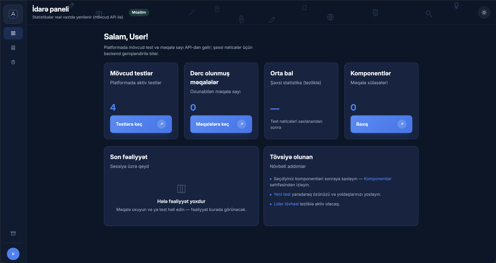

# Akademik Hub (akademik-project)

Akademik Hub elmi və texniki fənlər üzrə məqalə bazası və vaxt məhdudiyyətli test sistemi olan veb platformadır. Məqsəd: müəllim/tədqiqatçıların material (məqalə) yükləyib idarə etməsi, tələbələrin isə həmin materiallar əsasında testlərlə biliklərini yoxlaması və nəticəni görməsidir.

## Sayt üçün təqdimat mətni

Akademik Hub tədris materiallarını (məqalələri) və qiymətləndirməni (testləri) bir yerdə birləşdirən modul əsaslı platformadır. Müəllim və tədqiqatçılar məqalələri linkdən, PDF/DOCX faylından və ya əl ilə yaradıb kitab vizualında idarə edir; tələbələr isə həmin materialları oxuyur, vaxt məhdudiyyətli testlərlə biliklərini yoxlayır və nəticəni dərhal görür.

Platformanın məqsədi məzmunu toplamaqla yanaşı, onu praktik yoxlama vasitəsinə çevirməkdir: məqalədən test yaratmaq, PDF/DOCX ilə sualları avtomatik doldurmaq və ya AI ilə sual hazırlamaq kimi axınlar məzmun hazırlama müddətini azaldır və dərs prosesini sürətləndirir.

Bu repo `npm workspaces` ilə qurulmuş monorepo-dur:

- `apps/client` — React + Vite (UI)
- `apps/server` — Node.js + Express (API)
- `packages/shared` — TypeScript tipləri və Zod validasiyası (client/server ortaq)

## Ekran görüntüləri

Layihənin şəkillərini `docs/images/` qovluğuna əlavə edib aşağıdakı linkləri real fayl adları ilə saxlaya bilərsiniz. Şəxsi məlumat görünməməsi üçün screenshot götürməzdən əvvəl real email, API açarı, MongoDB connection string və şəxsi istifadəçi datalarını gizlədin.

| Bölmə | Şəkil |
| --- | --- |
| Giriş səhifəsi | `docs/images/login.png` |
| Dashboard | `docs/images/dashboard.png` |
| Məqalələr siyahısı | `docs/images/articles.png` |
| Məqalə editoru | `docs/images/article-editor.png` |
| Test yaratma | `docs/images/test-create.png` |
| Test həll etmə | `docs/images/test-detail.png` |

Şəkilləri əlavə etdikdən sonra bu nümunə formatdan istifadə edin:

```md

```

## Əsas funksiyalar

### 1) Giriş və rollar

- Qeydiyyat / giriş / çıxış (cookie-sessiya).
- Rol dəstəyi: `student`, `teacher`, `researcher`.
- Public qeydiyyatda yeni hesablar avtomatik `student` kimi yaradılır.
- `teacher` / `researcher` rolları yalnız mövcud `researcher` tərəfindən server API-si ilə dəyişdirilə bilər.
- Məhdudiyyətlər:
  - Tələbə: yalnız öz məqalə/testlərini və müəllim/tədqiqatçıların paylaşdıqlarını görür.
  - Müəllim/Tədqiqatçı: daha geniş idarəetmə və export imkanları.

### 2) Navigasiya və UI

- Sol panel (sidebar) açıq/qapalı vəziyyəti yadda saxlanır (refresh-dən sonra da qalır).
- Navbar:
  - Cari səhifə başlığı və alt yazı (route-a görə).
  - Saat (saniyə ilə) və Bakı hava durumu.
  - Dark/Light toggle.
  - Dekor üçün yüngül animasiyalı ikon fonu (login səhifəsindəki ikon sistemi ilə).
- Yuxarı bildirişlər (toast): yarat/saxla/sil/bərpa kimi əməliyyatlardan sonra xəbərdarlıq.

## Məqalələr modulu

### 1) Məqalələr siyahısı (`/app/articles`)

- Dərc olunmuş məqalələr göstərilir.
- Axtarış: məqalə başlığı və məzmun üzrə.
- Görünüş seçimi: `grid` / `list` (seçim yadda saxlanır).
- Filter paneli:
  - Teq üzrə filter
  - Sıralama (ən yeni, ən köhnə, A–Z, Z–A)
- Kart görünüşü “kitab” vizualındadır.
  - Üzlük rəngi və vurğu rəngi məqalənin üzərində görünür.

### 2) Məqalə yarat / redaktə (`/app/articles/new`, `/app/articles/:id/edit`)

Məqalə editoru iki mərhələlidir:

1. Məqalə məzmunu: başlıq, rich-text məzmun, status, teqlər, mənbə linki (istəyə bağlı).
2. Üzlük dizaynı: kitab rəngi və vurğu rəngi.

Rich-text editor sadə Markdown-əsaslı formatlama saxlayır:

- Qalın / italik
- Başlıq (H2/H3)
- Siyahı / nömrəli siyahı
- Sitat
- Link

Teqlər:

- əlavə et / sil / klikləyib redaktə et.

### 3) Linkdən və fayldan idxal

Məqalə editorunda:

- Mənbə linki daxil edib “Linkdən doldur” ilə başlıq, məzmun və teqləri avtomatik gətirmək olur.

Server tərəfində əlavə olaraq:

- PDF/DOCX faylından məqalə idxalı endpoint-i var (mətn çıxarılıb draft kimi qaytarılır).

### 4) Məqalə detalı (`/app/articles/:id`)

- Məqalə mətni rich-text kimi render olunur.
- Uzun məqalələr üçün “Daha çox göstər / Daha az göstər”.
- Sahib (yaradıcı) üçün:
  - Redaktə et
  - Sil (zibil qutusuna göndərir)
  - Bu məqalədən test yarat
- PDF export: məqaləni `.pdf` kimi yükləmək olur.

### 5) Mənim məqalələrim (`/app/articles/mine`)

- Öz məqalələrin siyahısı.
- Axtarış və filter paneli.
- Toplu silmə (zibil qutusuna göndərmə):
  - “Sil” düyməsi ilə seçim rejimi
  - Birdən çox məqaləni seçib bir dəfəlik zibil qutusuna göndərmək

### 6) Arxiv (`/app/articles/archive`)

- Status-u `archived` olan məqalələr.
- Axtarış və filter paneli.

### 7) Zibil qutusu (`/app/articles/trash`)

- Silinmiş məqalələr burada görünür.
- 30 gün saxlanılır, sonra avtomatik silinir (TTL).
- “Bərpa et” ilə geri qaytarmaq olur.
- “Kalıcı sil” ilə birdəfəlik silmək olur.

## Testlər modulu

### 1) Testlər siyahısı (`/app/tests`)

- Test kartları vizual “test vərəqi” üslubundadır.
- Kart üzərində:
  - Sual sayı və vaxt limiti
  - Testin sual tipləri (Çoxseçimli, Doğru/Yanlış, Qısa cavab)
  - İstifadəçinin son cəhdinə görə progress faizi və müddət (əgər həll edilibsə)
- Toolbar:
  - `Redaktə et` rejimi: aktiv olanda kartın üstündə qələm overlay görünür, karta klik edəndə edit açılır.
  - `+ Yeni test`
  - `Yüklə` (import): `.json`, `.pdf`, `.docx`

### 2) Test yarat / redaktə (`/app/tests/new`, `/app/tests/:id/edit`)

3 addımlı yaradılma axını:

1. Əsas məlumat: başlıq, təsvir, mənbə növü, vaxt limiti.
2. Mənbə və AI:
   - PDF/DOCX mətni çıxartmaq
   - Saytdakı məqalədən istifadə etmək (məqalə seçimi)
   - AI ilə sual yaratmaq (OpenAI / Gemini / DeepSeek)
3. Suallar:
   - Sualları əl ilə düzəltmək və testi yaratmaq/yeniləmək.

Çoxseçimli suallarda standart variant sayı: 5 (A–E).

### 3) PDF/DOCX/JSON import (avtomatik doldurma)

`.json`:

- Export schema-ya uyğun JSON faylı suallara avtomatik doldurulur.

`.pdf` və `.docx`:

- Fayldan mətn çıxarılır, sonra sual/variantlar avtomatik parse olunur.
- Ən stabil format:

```text
1. Gbit nəyə bərabərdir?
A) 10 bit
B) 1000000 bayt
C) 2^18 bit
D) 1000 Kbayt
E) 2^30 bit
Düzgün cavab: E
Xal: 1
```

Qeyd:

- DOCX/PDF mətnində sətirlər “bitişik” gəlsə belə parser onları ayırmağa çalışır.
- Sual tapılmasa, mətn yenə saxlanır və AI ilə sual yaratmaq üçün istifadə oluna bilər.
- Import zamanı başlıq/təsvir/vaxt limiti avtomatik təklif olunur:
  - Vaxt limiti qaydası: `1 sual = 1 dəqiqə`.

### 4) Test həll etmə (`/app/tests/:id`)

- Tək sual ekranı + sağda timer paneli (vaxt varsa).
- “Sual siyahısı” paneli:
  - Açılıb/bağlanır
  - Cavablanan sual statusu görünür.
- Vaxt bitəndə test avtomatik submit olunur.
- Submitdən sonra nəticə `score / maxScore` kimi göstərilir.
- Düzgün cavablar həll etmə ekranında göstərilmir.
  Qeyd:
- `Qısa cavab` sualları üçün avtomatik qiymətləndirmə MVP-də aktiv deyil (manual grading placeholder).

### 5) Export

- Test JSON export (`/api/tests/:id/export.json`) — paylaşmaq və yenidən import etmək üçün.
- Test PDF export (`/api/tests/:id/export.pdf`) — suallar/variantlar və (yaradıcı üçün) düzgün cavab işarələməsi ilə.

### 6) Statistika (API)

- `GET /api/tests/:id/stats` endpoint-i:
  - iştirak sayı, orta nəticə, ən yaxşı nəticə
  - sual üzrə doğru cavab faizi və s.

## Profil və ayarlar

- Profil menyusu sidebar-da açılır:
  - Profil ayarları: ad və profil rəngi.
  - Mənim məqalələrim
  - Zibil qutusu
- Menyu kənara klikdə, route dəyişəndə və panel bağlananda avtomatik bağlanır.

## Komponentlər (icmal)

- `Komponentlər` səhifəsi dərc olunmuş məqalələrin məzmunundan əsas məqamları (highlight/bullet) çıxarıb sürətli icmal kimi göstərir.
- Oxuma vaxtı təxmini hesablanır və mənbə linki varsa çıxış verilir.

## Texniki detallar (stack)

- Client: React 18, React Router, Zustand, Vite, TypeScript
- Server: Express, Mongoose (MongoDB), express-session + connect-mongo, multer, pdf-parse, mammoth, pdfkit
- Shared: Zod schema-ları + ortaq tiplər

## Layihəni lokal işə salmaq

### Tələblər

- Node.js LTS
- npm
- MongoDB: lokal MongoDB serveri və ya MongoDB Atlas

`node_modules` qovluğu GitHub-a yüklənmir. Layihəni yükləyən hər kəs dependency-ləri öz kompüterində qurmalıdır:

```bash
npm install
```

Bu command root qovluqda işlədilməlidir. Repo monorepo olduğu üçün `apps/client`, `apps/server` və `packages/shared` paketləri npm workspace kimi birlikdə qurulur.

### 1) Repo-nu yüklə

```bash
git clone <repo-url>
cd "Akademik Hub"
```

### 2) Dependency-ləri quraşdır

```bash
npm install
```

### 3) `.env` fayllarını yarat

Real `.env` faylları public repo-ya əlavə olunmur. Nümunə faylları kopyalayın:

```bash
cp apps/server/.env.example apps/server/.env
cp apps/client/.env.example apps/client/.env
```

### 4) MongoDB bağlantısını qur

Lokal MongoDB istifadə edirsinizsə, MongoDB serverini başladın və `apps/server/.env` faylında belə saxlayın:

```env
MONGODB_URI=mongodb://127.0.0.1:27017/akademik
```

MongoDB Atlas istifadə edirsinizsə, Atlas panelindən connection string götürüb yalnız öz lokal `apps/server/.env` faylınıza yazın:

```env
MONGODB_URI=mongodb+srv://<username>:<password>@<cluster-url>/akademik?retryWrites=true&w=majority
```

`<username>`, `<password>` və `<cluster-url>` real dəyərlərlə əvəz olunmalıdır. Bu dəyərləri README-yə, commit-ə və ya public GitHub-a yazmayın.

### 5) Server env dəyərləri

`apps/server/.env` üçün minimal lokal nümunə:

```env
PORT=4000
NODE_ENV=development
MONGODB_URI=mongodb://127.0.0.1:27017/akademik
SESSION_SECRET=change-this-to-a-long-random-secret
CLIENT_ORIGIN=http://localhost:5173
```

`SESSION_SECRET` production-da uzun, random və şəxsi saxlanılan dəyər olmalıdır.

AI ilə test yaratmaq istəyirsinizsə, uyğun açarı yalnız lokal `apps/server/.env` faylına yazın:

```env
OPENAI_API_KEY=
OPENAI_MODEL=gpt-4o-mini
GEMINI_API_KEY=
GEMINI_MODEL=gemini-2.0-flash
DEEPSEEK_API_KEY=
DEEPSEEK_MODEL=deepseek-chat
```

AI açarları boş qalsa, layihənin əsas funksiyaları işləyir; sadəcə AI sual yaratma üçün açar tələb olunur.

### 6) Client env dəyərləri

`apps/client/.env` lokal nümunə:

```env
VITE_API_URL=http://localhost:4000
```

Development zamanı Vite proxy də istifadə olunur, amma production deployment üçün client-in API URL-i real server ünvanına yönləndirilməlidir.

### 7) Development serverləri başladın

Root qovluqda:

```bash
npm run dev
```

Default lokal ünvanlar:

- Client: `http://localhost:5173`
- Server API: `http://localhost:4000`
- Health check: `http://localhost:4000/api/health`

### Faydalı command-lər

```bash
npm run typecheck
npm run build
npm audit --audit-level=high
```

## Public GitHub qeydləri

- `apps/server/.env` və `apps/client/.env` Git-ə düşməməlidir; yalnız `.env.example` faylları paylaşılır.
- MongoDB connection string, session secret, AI API açarları, private key/cert faylları və şəxsi email/parollar repo-ya əlavə olunmamalıdır.
- İlk `researcher` hesabını production DB-də əl ilə yüksəldin; sonrakı rol dəyişiklikləri yalnız `researcher` sessiyası ilə edilməlidir.
- Linkdən məqalə idxalı localhost/private network ünvanlarını bloklayır; bu, public deployment üçün SSRF riskini azaldır.
- Production üçün `NODE_ENV=production`, real `CLIENT_ORIGIN`, güclü `SESSION_SECRET` və HTTPS proxy konfiqurasiyası istifadə edin.

## Qısa yekun

Akademik Hub müəllim/tədqiqatçı üçün “məqalə + test hazırlama”, tələbə üçün isə “oxu + testlə yoxla” axınını bir platformada birləşdirir. Məqalələr kitab vizualında idarə olunur, testlər isə import/AI dəstəyi ilə tez hazırlanır və vaxt məhdudiyyətli şəkildə həll olunur.

## Status

- `Lider lövhəsi` və `Elektro (tədqiqat)` kimi bəzi bölmələr hazırda placeholder kimi qurulub və sonradan genişləndiriləcək.
